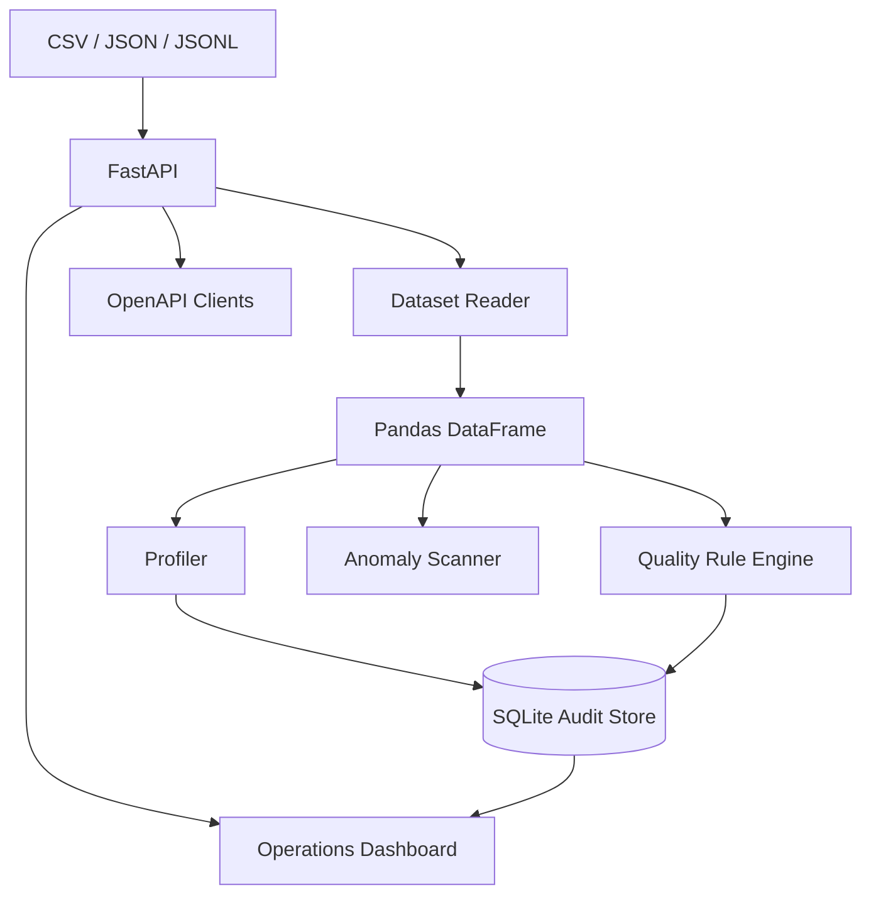

# Architecture

Data Quality Command Center separates file ingestion, dataframe analysis, rule evaluation, and audit persistence so each layer can be replaced independently.

## Design choices

**Pandas** provides mature type inspection, vectorized validation, and concise statistical profiling. The rule engine is deliberately independent of FastAPI so it can be reused from the CLI, tests, scheduled jobs, or a future batch worker.

**SQLite** persists metadata and quality results while raw uploaded files remain in file storage. A production version could move metadata to PostgreSQL and raw data to object storage without changing the validation interface.

## Quality scoring

The initial score is intentionally transparent: percentage of configured rules that pass. Violation counts remain separate so teams can distinguish a single failed rule affecting one row from the same rule affecting millions of rows.

## Production evolution

At scale, ingestion would move to object storage, profiles could run as queue-backed workers, and metadata would live in a warehouse/catalog service. The same rule contract can be applied to batch pipelines before downstream publication.
